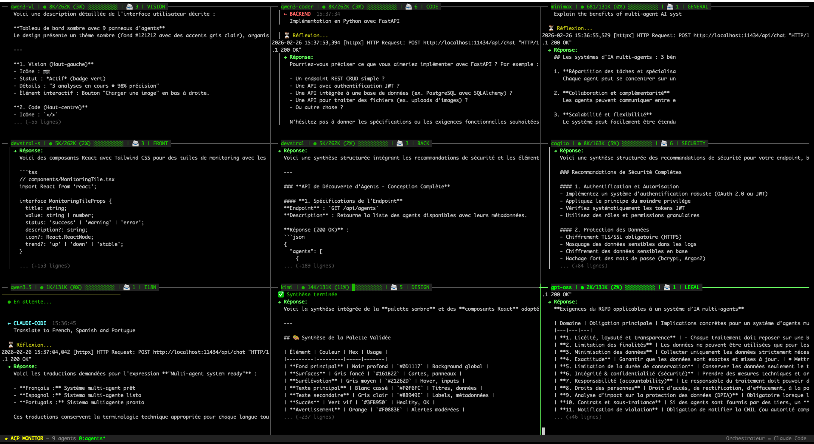

# ACP Agents — Multi-Agent System with ACP/A2A Protocol

<div align="center">

**9 specialized AI agents + 1 meta-optimizer, communicating via REST protocol**

[](#protocols)
[](#agents)
[](#quick-start)
[](#license)

[English](#overview) | [Francais](#apercu)

</div>

---

<div align="center">

### tmux Monitor — 9 Agents in Action



*Real-time monitoring of 9 specialized agents processing tasks simultaneously*

</div>

---

## Overview

ACP Agents is an open-source multi-agent system where **9 specialized AI agents** collaborate to handle complex tasks. Each agent has a specific expertise (code, security, design, legal, etc.) and can **delegate tasks to other agents** automatically.

The system supports two parallel implementations:
- **Ollama Cloud** — 9 agents running on local HTTP servers, powered by open-source models via Ollama
- **Anthropic (Claude)** — Same 9 agents powered by Claude models (Opus, Sonnet, Haiku) via the Task tool

Both versions implement the same protocols: **ACP** (Agent Communication Protocol) and **A2A** (Agent-to-Agent by Google).

### Key Features

- **Inter-agent delegation** — Agents automatically route subtasks to the right specialist
- **Stateful sessions** — Multi-turn conversations between agents with memory
- **SSE streaming** — Real-time token streaming via Server-Sent Events
- **Agent Cards** — Standardized JSON identity for each agent (ACP/A2A compliant)
- **Auto-discovery** — Agents discover each other dynamically via `/.well-known/agent.json`
- **MCP integration** — Plug into Claude Code CLI as MCP tools
- **EVOLVE meta-agent** — Automatically evaluates and improves all agents via semantic prompt evolution
- **Visual monitoring** — tmux-based real-time dashboard for agent activity
- **Security hardened** — CORS, rate limiting, input validation, path traversal protection

---

## Demo Results — Two Systems Side by Side

### Ollama Cloud (9 agents on HTTP ports)

<div align="center">

</div>

Real agents processing tasks simultaneously in tmux, with inter-agent delegation visible in real-time.

### Anthropic (Claude models via Task tool)

Same agents, powered by Claude models (Opus for deep reasoning, Sonnet for code, Haiku for speed):

| Agent | Model | Task | Result |
|-------|-------|------|--------|
| CODE (Sonnet) | `claude-sonnet-4-6` | Write `is_prime()` with tests | O(sqrt(n)), error handling, 8 tests |
| SECURITY (Opus) | `claude-opus-4-6` | Audit code for vulnerabilities | Found CWE-78 (injection) + CWE-22 (path traversal) |
| I18N (Haiku) | `claude-haiku-4-5` | Translate to ES/PT/AR | 3 languages, professional quality |

> See full demo results in [docs/anthropic-demo.md](docs/anthropic-demo.md)

Both systems implement the same ACP/A2A protocol and can be used interchangeably depending on your needs.

---

## Architecture

```
User / Orchestrator
    |
    v
 Orchestrator (see "Orchestrator Options" below)
    |
    |--- MCP (mcp_server.py, stdio) --- Claude Code CLI
    |
    +--- HTTP REST (ports 8002-8010)
              |
              v
    +---------------------------------------------+
    |  9 Specialized Agents (ACP + A2A)           |
    |                                             |
    |  vision    (8002) qwen3-vl  235B            |
    |  code      (8003) qwen3-coder 80B           |
    |  generalist(8004) minimax-m2.5              |<--- Inter-agent
    |  frontend  (8005) devstral-s2 24B           |     delegation
    |  backend   (8006) devstral-2 123B           |     [DELEGATE:x:msg]
    |  security  (8007) cogito 671B               |
    |  i18n      (8008) qwen3.5 122B              |
    |  design    (8009) kimi-k2.5                 |
    |  legal     (8010) gpt-oss 120B              |
    +----------------------+----------------------+
                           |
                           v
                    Ollama Cloud (0 GB local RAM)
```

### Inter-Agent Delegation Example

A single prompt can trigger a chain of delegations:

```
ORCHESTRATOR
    +---> CODE (writes function)
    |       +---> SECURITY (audits code)
    |       +---> FRONTEND (creates UI component)
    |       <--- synthesizes corrected code
    +---> I18N (translates to 3 languages)
    +---> LEGAL ---> GENERALIST (compliance check)
```

Max depth: 3 levels (anti-infinite loop protection)

---

## Agents

### Ollama Cloud Agents (ports 8002-8010)

| Agent | Port | Model | Params | Capabilities | Role |
|-------|------|-------|--------|-------------|------|
| vision | 8002 | qwen3-vl:235b-cloud | 235B | vision, tools, thinking | Images, OCR, screenshots |
| code | 8003 | qwen3-coder-next:cloud | 80B | tools | Development, debugging |
| generalist | 8004 | minimax-m2.5:cloud | — | tools, thinking | Multi-purpose, brainstorming |
| frontend | 8005 | devstral-small-2:24b-cloud | 24B | vision, tools | UI, React, CSS, responsive |
| backend | 8006 | devstral-2:123b-cloud | 123B | tools | API, database, infrastructure |
| security | 8007 | cogito-2.1:671b-cloud | 671B | — | Security audits, vulnerabilities |
| i18n | 8008 | qwen3.5:cloud | 122B | vision, tools, thinking | Translations, multilingual |
| design | 8009 | kimi-k2.5:cloud | — | vision, tools, thinking | UX, mockups, accessibility |
| legal | 8010 | gpt-oss:120b-cloud | 116.8B | tools, thinking | GDPR, compliance, legal |

### Anthropic Agents (via Task tool)

| Agent | Model | Why |
|-------|-------|-----|
| vision | Sonnet | Multimodal vision, fast |
| code | Sonnet | Good code generation, fast |
| generalist | Haiku | Simple tasks, very fast |
| frontend | Sonnet | UI/React, good balance |
| backend | Sonnet | API/SQL, reliable |
| security | Opus | Deep reasoning for complex vulnerabilities |
| i18n | Haiku | Fast translations |
| design | Sonnet | UX/Design with vision |
| legal | Opus | Deep legal reasoning |

### EVOLVE Meta-Agent

The EVOLVE agent evaluates and improves all other agents through semantic prompt evolution. Inspired by [AlphaEvolve (Google DeepMind)](https://deepmind.google/discover/blog/alphaevolve-a-gemini-powered-coding-agent-for-designing-advanced-algorithms/).

- **Ollama version**: `python3 evolve/evolve_runner.py eval-all` (glm-5:cloud, port 8011)
- **Anthropic version**: Uses Opus via Task tool to evaluate agents
- **Cycle**: BENCHMARK → EXECUTION → SCORING (6 dimensions) → ANALYSIS → MUTATION → SELECTION

---

## Quick Start

### Prerequisites

- Python 3.10+
- [Ollama](https://ollama.ai/) installed with cloud models configured
- `httpx` package: `pip install httpx`
- (Optional) `tmux` for visual monitoring
- (Optional) `requests` package for `client.py`

### 1. Clone the repository

```bash
git clone https://github.com/abdelhadi703/acp-agents.git
cd acp-agents
```

### 2. Configure Ollama models

Make sure your Ollama instance has the required cloud models. You can use any Ollama-compatible models by editing the `AGENTS` dict in `acp_server.py`:

```python
# acp_server.py — change models to match your setup
AGENTS = {
    "code": {
        "model": "qwen3-coder-next:cloud",  # change this to your model
        "port": 8003,
        "role": "Code generation and analysis",
        "color": "\033[1;32m"
    },
    # ...
}
```

### 3. Launch the agents

#### Option A: tmux monitor (visual — recommended)

```bash
./launch-agents.sh          # Starts 9 agents in tmux panes
tmux attach -t agents       # Open the monitor in another terminal
```

#### Option B: Daemon mode (background)

```bash
./agents-daemon.sh start    # Start all 9 agents
./agents-daemon.sh status   # Check status
./agents-daemon.sh stop     # Stop all
./agents-daemon.sh restart  # Restart all
```

#### Option C: Single agent

```bash
python3 agent_runner.py code        # Start just the code agent
python3 agent_runner.py security    # Start just the security agent
```

#### Option D: Python starter

```bash
python3 start_all.py        # Start all agents (Python subprocess)
```

### 4. Test it

```bash
# Check agent status
curl http://localhost:8003/status

# Send a message
curl -X POST http://localhost:8003/message \
  -H "Content-Type: application/json" \
  -d '{"message": "Write a Python hello world function", "from": "user"}'

# Discover all agents (A2A)
curl http://localhost:8003/.well-known/agent.json

# ACP Discovery
curl http://localhost:8003/agents/discover

# Create a session
curl -X POST http://localhost:8003/sessions -d '{}'

# Stream a response (SSE)
curl -N -X POST http://localhost:8003/message/stream \
  -H "Content-Type: application/json" \
  -d '{"message": "Explain Python decorators"}'
```

---

## Orchestrator Options

The agents are **orchestrator-agnostic**. Any tool that can make HTTP requests can orchestrate them. Here are the tested options:

### 1. Claude Code (recommended)

[Claude Code](https://docs.anthropic.com/en/docs/claude-code) by Anthropic — the most powerful option.

**Setup**: Add to your Claude Code MCP config (`~/.claude/settings.json`):

```json
{
  "mcpServers": {
    "acp-agents": {
      "command": "python3",
      "args": ["/path/to/acp-agents/mcp_server.py"]
    }
  }
}
```

Claude Code then gets 14 MCP tools: `ask_vision`, `ask_code`, `ask_frontend`, `ask_backend`, `ask_security`, `ask_i18n`, `ask_design`, `ask_legal`, `ask_generalist`, `ask_orchestrator`, `list_agents`, `discover_agents`, `create_session`, `session_message`.

It can also call agents directly via `curl` in Bash.

### 2. Kilo Code

[Kilo Code](https://kilocode.ai/) — VS Code extension with MCP support.

**Setup**: Add to Kilo's MCP configuration:

```json
{
  "mcpServers": {
    "acp-agents": {
      "command": "python3",
      "args": ["/path/to/acp-agents/mcp_server.py"]
    }
  }
}
```

### 3. OpenCode

[OpenCode](https://github.com/opencode-ai/opencode) — Open-source terminal AI assistant.

**Setup**: Add to `opencode.json`:

```json
{
  "mcp": {
    "acp-agents": {
      "command": "python3",
      "args": ["/path/to/acp-agents/mcp_server.py"]
    }
  }
}
```

### 4. Qwen Code (qwen-agent)

[Qwen Agent](https://github.com/QwenLM/Qwen-Agent) — Alibaba's AI agent framework.

**Setup**: Configure as custom tool calling endpoint, or use the HTTP REST API directly:

```python
import requests

response = requests.post("http://localhost:8003/message", json={
    "message": "Write a sorting algorithm",
    "from": "qwen-agent"
})
print(response.json()["response"])
```

### 5. Any HTTP client

Since agents expose a standard REST API, any tool that can make HTTP requests can orchestrate:

```bash
# curl
curl -X POST http://localhost:8003/message \
  -H "Content-Type: application/json" \
  -d '{"message": "Hello", "from": "my-tool"}'

# Python
import requests
r = requests.post("http://localhost:8003/message", json={"message": "Hello"})

# JavaScript
fetch("http://localhost:8003/message", {
  method: "POST",
  body: JSON.stringify({ message: "Hello" })
})
```

---

## Protocols

### ACP (Agent Communication Protocol)

REST-based protocol for agent communication. Each agent exposes:

| Endpoint | Method | Description |
|----------|--------|-------------|
| `/status` | GET | Agent status (model, tokens, messages, capabilities) |
| `/agents` | GET | List all known agents |
| `/message` | POST | Send a message `{message, from, depth}` |
| `/message/stream` | POST | SSE streaming response |
| `/delegate` | POST | Delegate to another agent `{target, message}` |
| `/sessions` | GET | List all sessions |
| `/sessions` | POST | Create a new session `{metadata}` |
| `/sessions/{id}` | GET | Get session history |
| `/sessions/{id}/messages` | POST | Send message in session `{message, from}` |
| `/sessions/{id}` | DELETE | Close a session |
| `/agents/discover` | GET | Discover all agents (Ollama + Anthropic cards) |

### A2A (Agent-to-Agent)

Google's agent discovery protocol. Each agent serves its **Agent Card** at:

```
GET /.well-known/agent.json
```

Returns:
```json
{
  "name": "code",
  "displayName": "Code Agent",
  "description": "Software development, refactoring, debugging",
  "version": "2.0",
  "protocol": "acp+a2a",
  "capabilities": {
    "streaming": true,
    "multimodal": false,
    "tools": true
  },
  "model": {
    "name": "qwen3-coder-next:cloud",
    "parameters": "80B",
    "system": "ollama"
  },
  "endpoints": {
    "message": "/message",
    "stream": "/message/stream",
    "status": "/status",
    "card": "/.well-known/agent.json",
    "sessions": "/sessions",
    "discover": "/agents/discover"
  },
  "skills": ["typescript", "python", "refactoring", "debugging"]
}
```

### Agent Cards

18 Agent Cards total (9 Ollama + 9 Anthropic) stored in `agent_cards/`:

```
agent_cards/
├── ollama/
│   ├── vision.json
│   ├── code.json
│   ├── generalist.json
│   ├── frontend.json
│   ├── backend.json
│   ├── security.json
│   ├── i18n.json
│   ├── design.json
│   └── legal.json
└── anthropic/
    ├── vision.json
    ├── code.json
    └── ... (same 9 agents)
```

---

## MCP Server

The MCP server (`mcp_server.py`) connects agents to Claude Code CLI via the [Model Context Protocol](https://modelcontextprotocol.io/).

**14 tools available:**

| Tool | Description |
|------|-------------|
| `ask_orchestrator` | Coordinator agent (glm-5, 744B) |
| `ask_vision` | Vision/images agent (qwen3-vl, 235B) |
| `ask_code` | Code agent (qwen3-coder, 80B) |
| `ask_generalist` | Multi-purpose agent (minimax-m2.5) |
| `ask_frontend` | Frontend agent (devstral-small-2, 24B) |
| `ask_backend` | Backend agent (devstral-2, 123B) |
| `ask_security` | Security agent (cogito-2.1, 671B) |
| `ask_i18n` | i18n agent (qwen3.5, 122B) |
| `ask_design` | Design/UX agent (kimi-k2.5) |
| `ask_legal` | Legal/GDPR agent (gpt-oss, 120B) |
| `list_agents` | List all agents with status |
| `discover_agents` | ACP/A2A discovery (all 18 Agent Cards + live status) |
| `create_session` | Create a stateful session with an agent |
| `session_message` | Send a message within an existing session |

---

## tmux Monitor

The tmux monitor provides a real-time visual dashboard of all 9 agents:

```
┌── qwen3-vl | ● 12K/235K (5%) ██░░░░░░░░ | 📨 3 | VISION ──────────────┐
│ ← CLAUDE-CODE 16:20                                                      │
│ ⟶ → DESIGN                                                               │
│ ⟵ REÇU DESIGN                                                            │
├── qwen3-coder | ● 8K/80K (10%) █░░░░░░░░░ | 📨 5 | CODE ────────────────┤
│ ← CLAUDE-CODE                                                             │
│ ⟶ → SECURITY                                                              │
│ ⟵ REÇU SECURITY                                                           │
├── devstral | ● 4K/123K (3%) ░░░░░░░░░░ | 📨 2 | BACK ───────────────────┤
│ ← CLAUDE-CODE                                                             │
│ → Réponse API                                                              │
└────────────────────────────────────────────────────────────────────────────┘
 ★ ACP MONITOR — 9 agents                          Orchestrateur = Claude Code
```

Each pane title bar shows:
- Model name and token usage (used/total, percentage, visual bar)
- Message count
- Agent name

Legend:
- `← NAME` — message received from agent
- `⟶ → NAME` — delegation sent
- `⟵ REÇU NAME` — delegation result received
- `→ Response` — agent's response

---

## Project Structure

```
acp-agents/
├── acp_server.py          # Core: agent config, ACP protocol, sessions, Ollama API
├── agent_runner.py         # HTTP server for each agent (REST endpoints, delegation)
├── mcp_server.py           # MCP server for Claude Code CLI (14 tools)
├── client.py               # Python CLI client (interactive mode)
├── start_all.py            # Python subprocess launcher
├── launch-agents.sh        # tmux visual monitor launcher (9 panes)
├── agents-daemon.sh        # Daemon manager (start/stop/status/restart)
├── tmux-monitor.py         # tmux pane title updater (stats per agent)
├── agent_cards/
│   ├── ollama/             # 9 Ollama Agent Cards (JSON)
│   └── anthropic/          # 9 Anthropic Agent Cards (JSON)
├── evolve/
│   ├── evolve_runner.py    # EVOLVE meta-agent runner
│   ├── benchmarks.json     # 50 benchmark tasks (5 per agent + 5 collaborative)
│   ├── scores.json         # Evaluation scores history
│   ├── prompt-history.json # Prompt version tracking
│   └── prompts/            # Prompt backups (versioned)
├── sessions/               # Session storage (JSON dumps)
└── logs/                   # Agent logs (daemon mode)
```

---

## Security

The codebase has been security-audited and hardened:

- **CORS** — Restricted to localhost origins only (no wildcard `*`)
- **Input validation** — Message size limits (100KB), body size limits (1MB)
- **Path traversal protection** — `os.path.realpath()` + prefix validation on all file operations
- **UUID validation** — All session IDs validated as proper UUIDs
- **Rate limiting** — Max 100 sessions per agent, auto-cleanup of closed sessions
- **Thread safety** — `threading.Lock` for shared counters in multi-threaded HTTP server
- **Generic error messages** — No stack traces or internal details leaked to clients
- **Prompt injection protection** — Synthesis prompts include anti-injection instructions
- **PID validation** — Daemon scripts validate PIDs before sending signals
- **No hardcoded paths** — All paths are relative or environment-based

---

## Customization

### Using different models

Edit `acp_server.py` to change models for any agent:

```python
AGENTS = {
    "code": {
        "model": "codellama:70b",    # Any Ollama model
        "port": 8003,
        "role": "Code generation",
        "color": "\033[1;32m"
    },
}
```

### Using a different Ollama endpoint

```bash
export OLLAMA_API="http://your-server:11434/api"
./agents-daemon.sh start
```

### Adding a new agent

1. Add the agent to `AGENTS` dict in `acp_server.py`
2. Create Agent Cards in `agent_cards/ollama/` and `agent_cards/anthropic/`
3. Add the agent to `launch-agents.sh` and `agents-daemon.sh`
4. (Optional) Add an MCP tool in `mcp_server.py`
5. (Optional) Add benchmarks in `evolve/benchmarks.json`

---

## Environment Variables

| Variable | Default | Description |
|----------|---------|-------------|
| `OLLAMA_API` | `http://localhost:11434/api` | Ollama API endpoint |

---

## Requirements

```
httpx>=0.25.0
requests>=2.31.0  # Optional, for client.py
```

No heavy dependencies — the system uses Python's built-in `http.server` and `json` modules.

---

## License

MIT License — see [LICENSE](LICENSE) for details.

---

## Acknowledgments

- [ACP (Agent Communication Protocol)](https://agentcommunicationprotocol.dev/) — IBM / Linux Foundation
- [A2A (Agent-to-Agent)](https://google.github.io/A2A/) — Google
- [MCP (Model Context Protocol)](https://modelcontextprotocol.io/) — Anthropic
- [AlphaEvolve](https://deepmind.google/discover/blog/alphaevolve-a-gemini-powered-coding-agent-for-designing-advanced-algorithms/) — Google DeepMind (inspiration for EVOLVE)
- [Ollama](https://ollama.ai/) — Local LLM runtime

---

<div align="center">

**Built with Claude Code (Opus) as orchestrator**

</div>
